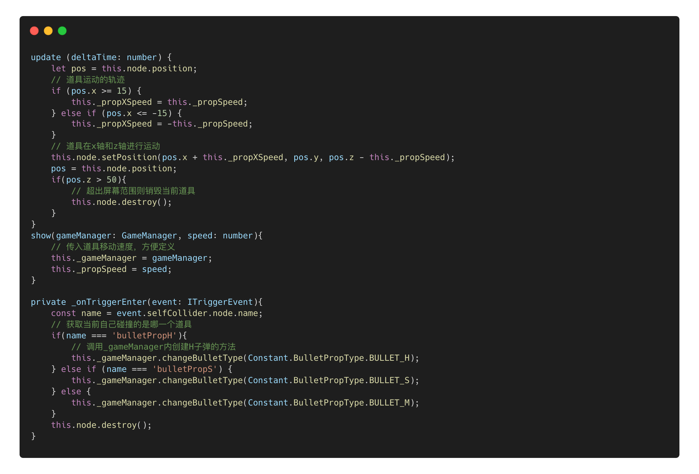

> 世界上最顶级的学习方法之一，费曼学习法，通过向别人解说某一件事，来确定自己是否真正弄懂这件事。
继续学习，有了上文的总结，本文将利用之前介绍的部分Cocos creator开发技术为大家简单分析，真实游戏开发过程中我们遇到的问题和解决方案。这里以cocos官方案例游戏飞机大战为例。

## 理清实现思路
0、主要场景搭建
1、不断滚动的背景
2、跟随手指移动的己方飞机
3、不断发射的子弹
4、多变的不同阵型的敌机
5、子弹、敌机、己机的碰撞
6、道具的变更（不同子弹类型）
7、UI面板实现

## 具体实现
### 0、主要场景搭建
选择一个合适的设计分辨率，假定为iphone xs (375 * 812)
新建一个相机，设置为正交相机（ORTHO）
新建一个材质，材质Effect选为`builtin-unlit`（不需要接受光照，可以较好的节省资源，减小包的体积），在USE_TEXTURE下选择主纹理（即背景图），创建飞机、子弹等用同样的方法创建材质。
新建一个平面节点（Plane），将刚刚新建的材质拖到该节点上
调整正交相机的远近大小，使用户视图处于一个合理的位置

### 1、不断滚动的背景
主要实现思路，用两张图拼接，使用`setPosition`不断改变图片的z轴位置，当一张图移出可见视图，则将其重置到另一张图的上方。不断循环，即可简单实现不断滚动的背景效果。要使用背景图需要用到之前所创建的背景控制节点，在该节点上我们挂载这两张图和控制脚本即可。这需要在我们实现背景滚动的脚本里加上`@property`，后面不再赘述。我会在代码中加上各种注释，方便新人理解。

### 2、跟随手指移动的己方飞机
计算手指移动的位置和长度，这里使用事件中的`event.getDelta()`，它返回一个二维向量，即获取触点距离上一次事件 UI 世界下移动的距离对象，对象包含 x 和 y 属性，然后根据（x，y）实时修改飞机的位置`setPosition`。
此处还要注意点按屏幕需要发射子弹，所以还得监听`Input.EventType.TOUCH_START` 等事件，在触摸屏幕期间设置一个变量标识正在射击。

### 3、不断发射的子弹
子弹包括己方子弹和敌方子弹，敌方是向下发射，而己方是向上发射，且敌方只有单架飞机需要发射子弹，其他队列出现的敌机不需要发射子弹，那么，创建子弹就需要做区分。
#### 子弹自身的逻辑：

#### 发射子弹的逻辑，还是依赖于DT(deltaTime)两帧之间的时间间隔：

#### 实例化预制和设置子弹位置，包括后续的一些碰撞检测逻辑：

### 4、多变的不同阵型的敌机
游戏策划案中主要有三种依次随机出现的敌机出现方式，一种是单架敌机，需要发射子弹，一种是一字排开的飞机、还有一种是人字形出现的飞机。具体逻辑已在注释中写明。

#### 敌机自身飞行和子弹逻辑：

#### 单架敌机：
单架敌机这里可以随机出现1或2的飞机种类，使用`math.randomRangeInt(1, 3)`来获取随机数，针对不同的随机数获取不同的敌机预制和飞行速度。使用`getComponent`获取到上面定义好的`EnemyPlane`组件，并将其在预定位置上显示出来。

#### 一字排开的敌机：
非常简单，即从预制实例化出多个节点，x轴间隔10个单位依次排开

#### 人字形排开的敌机：
设定好几个预定的位置，这个阵型的位置可以多准备几个随机显示，以提高随机的多元化。

### 5、子弹、敌机、己机的碰撞
首先：为已经制作好各种子弹、敌机、己机等预制体加上碰撞体和刚体，调整碰撞体的大小，并更新到资源。因为这里不需要涉及到物理层面的属性，所以我们Is Trigger勾选，使用触发事件来捕获碰撞。

定义本游戏的碰撞矩阵，规定哪些模块直接可以进行碰撞，上回我们讲到，可以在项目设置的物理模块进行设置。设置完之后给当前刚体选择Group。

在代码层面，在各自的TS脚本内获取到当前碰撞体，监听`onTriggerEnter`事件，然后由此判断当前碰撞的对象是什么，来做不同的事情。这里只展示了敌机的碰撞捕获，其他同理。

### 6、道具的变更（不同子弹类型）
道具会沿着S形轨迹飞行，与己方飞机发生碰撞之后需要切换子弹类型。所以我们要设置道具为碰撞体，新增碰撞矩阵类型，定义道具的飞行轨迹。这与之前的一些操作类似。
#### 创建道具，随机道具的出现种类，分别获取不同的预制：

#### 创建H型子弹示例，其实就是多实例化几个子弹节点，定好位置就行：

#### 点按屏幕发射子弹时根据当前不同道具类型创建不同的子弹：

#### 道具自身的运动及与己机碰撞之后改变gameManage内的子弹发射类型：

### 7、UI面板实现
这里主要是实现开始游戏以及结束游戏等界面。涉及到一些UI的布局和状态切换，以及组件重置，分数的累计等。比如widget组件及label等组件的使用，本期笔者暂不实现，待后续有时间补充。
